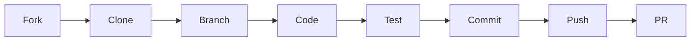
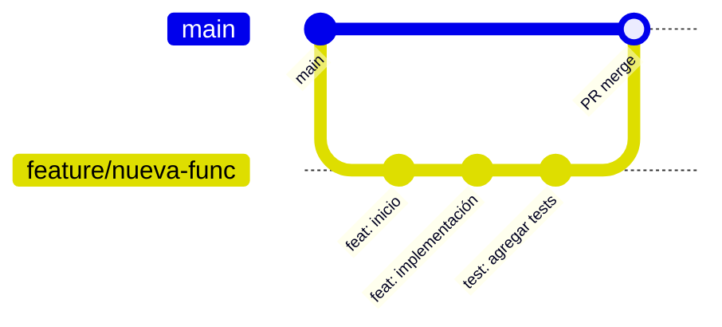

<div align="center">


# 🤝 Contributing Guide

**KB React Calculator** - Guía de Contribución

[](http://makeapullrequest.com)
[](https://github.com/KRSNA-BLR/Beginner-Friendly-React-Native-Calculator-App/graphs/contributors)

[🇺🇸 English](./README.md) | [🇪🇸 Español](./README_ES.md)

</div>

---

## 📑 Tabla de Contenidos / Table of Contents

- [🌍 Idiomas / Languages](#-idiomas--languages)
- [🚀 Inicio Rápido / Quick Start](#-inicio-rápido--quick-start)
- [📋 Tipos de Contribución / Types of Contributions](#-tipos-de-contribución--types-of-contributions)
- [🔧 Configuración del Entorno / Environment Setup](#-configuración-del-entorno--environment-setup)
- [📝 Convenciones de Código / Code Conventions](#-convenciones-de-código--code-conventions)
- [🌿 Flujo de Git / Git Workflow](#-flujo-de-git--git-workflow)
- [✅ Checklist de PR / PR Checklist](#-checklist-de-pr--pr-checklist)
- [🐛 Reportar Bugs / Bug Reports](#-reportar-bugs--bug-reports)
- [💡 Sugerir Features / Feature Requests](#-sugerir-features--feature-requests)
- [📜 Código de Conducta / Code of Conduct](#-código-de-conducta--code-of-conduct)

---

## 🌍 Idiomas / Languages

Este documento está disponible en español e inglés. / This document is available in Spanish and English.

---

## 🚀 Inicio Rápido / Quick Start



```bash
# 1. Fork y clone
git clone https://github.com/TU-USUARIO/Beginner-Friendly-React-Native-Calculator-App.git
cd Beginner-Friendly-React-Native-Calculator-App

# 2. Instalar dependencias
npm install

# 3. Crear rama
git checkout -b feature/mi-nueva-feature

# 4. Desarrollar y testear
npm test
npm run lint

# 5. Commit y push
git add .
git commit -m "feat: agregar nueva funcionalidad"
git push origin feature/mi-nueva-feature

# 6. Abrir Pull Request en GitHub
```

---

## 📋 Tipos de Contribución / Types of Contributions

| Tipo | Descripción | Etiqueta |
|------|-------------|----------|
| 🐛 **Bug Fix** | Corrección de errores | `bug` |
| ✨ **Feature** | Nueva funcionalidad | `enhancement` |
| 📚 **Docs** | Mejoras de documentación | `documentation` |
| 🎨 **Style** | Mejoras de UI/UX | `ui` |
| ♻️ **Refactor** | Refactorización de código | `refactor` |
| 🧪 **Test** | Agregar o mejorar tests | `testing` |
| 🔧 **Config** | Cambios de configuración | `config` |

---

## 🔧 Configuración del Entorno / Environment Setup

### Prerrequisitos / Prerequisites

| Herramienta | Versión | Instalación |
|-------------|---------|-------------|
| Node.js | ≥ 18.x | [nodejs.org](https://nodejs.org/) |
| npm | ≥ 9.x | Incluido con Node.js |
| React Native CLI | ≥ 0.78.x | `npm install -g react-native` |
| Android Studio | Latest | [developer.android.com](https://developer.android.com/studio) |
| Xcode (macOS) | ≥ 15.x | App Store |

### Instalación / Installation

```bash
# Clonar tu fork
git clone https://github.com/TU-USUARIO/Beginner-Friendly-React-Native-Calculator-App.git
cd Beginner-Friendly-React-Native-Calculator-App

# Instalar dependencias
npm install

# iOS (solo macOS)
cd ios && pod install && cd ..

# Verificar instalación
npm test
npm run lint
npx tsc --noEmit
```

### Scripts Disponibles / Available Scripts

| Script | Descripción |
|--------|-------------|
| `npm start` | Inicia Metro Bundler |
| `npm run android` | Ejecuta en Android |
| `npm run ios` | Ejecuta en iOS |
| `npm test` | Ejecuta tests |
| `npm run test:coverage` | Tests con cobertura |
| `npm run lint` | Ejecuta ESLint |
| `npm run lint:fix` | Corrige errores de lint |
| `npm run clean` | Limpia caché |

---

## 📝 Convenciones de Código / Code Conventions

### Estructura de Archivos / File Structure

```
src/
├── components/          # Componentes de UI
│   └── ComponentName/
│       └── ComponentName.tsx
├── hooks/              # Custom hooks
│   └── useHookName.ts
├── utils/              # Funciones utilitarias
│   └── utilName.ts
├── constants/          # Constantes y configuración
│   └── constantName.ts
└── types/              # Tipos TypeScript
    └── index.ts
```

### Nomenclatura / Naming Conventions

| Tipo | Convención | Ejemplo |
|------|------------|---------|
| Componentes | PascalCase | `CalculatorButton.tsx` |
| Hooks | camelCase con `use` | `useCalculator.ts` |
| Utils | camelCase | `calculator.ts` |
| Constantes | SCREAMING_SNAKE_CASE | `BUTTON_COLORS` |
| Tipos/Interfaces | PascalCase | `ButtonConfig` |

### Estilo de Código / Code Style

```typescript
// ✅ Correcto
export const CalculatorButton: React.FC<ButtonProps> = ({ label, onPress }) => {
  const { colors } = useTheme();
  
  return (
    <TouchableOpacity onPress={onPress} style={[styles.button, { backgroundColor: colors.button }]}>
      <Text style={styles.label}>{label}</Text>
    </TouchableOpacity>
  );
};

// ❌ Incorrecto
export function calculatorButton(props) {
  return <TouchableOpacity onPress={props.onPress}><Text>{props.label}</Text></TouchableOpacity>
}
```

### Commits Semánticos / Semantic Commits

Usamos [Conventional Commits](https://www.conventionalcommits.org/):

| Prefijo | Uso |
|---------|-----|
| `feat:` | Nueva funcionalidad |
| `fix:` | Corrección de bug |
| `docs:` | Cambios en documentación |
| `style:` | Formateo, sin cambios de código |
| `refactor:` | Refactorización |
| `test:` | Agregar o modificar tests |
| `chore:` | Tareas de mantenimiento |

**Ejemplos:**
```bash
git commit -m "feat: agregar botón de factorial"
git commit -m "fix: corregir cálculo de logaritmo natural"
git commit -m "docs: actualizar README con nuevos diagramas"
git commit -m "test: agregar tests para useCalculator hook"
```

---

## 🌿 Flujo de Git / Git Workflow



### Ramas / Branches

| Rama | Propósito |
|------|-----------|
| `main` | Código de producción estable |
| `develop` | Desarrollo activo |
| `feature/*` | Nuevas funcionalidades |
| `fix/*` | Corrección de bugs |
| `docs/*` | Cambios de documentación |

---

## ✅ Checklist de PR / PR Checklist

Antes de enviar tu PR, asegúrate de:

- [ ] 🧪 Los tests pasan (`npm test`)
- [ ] 🔍 El código pasa el linter (`npm run lint`)
- [ ] 📝 TypeScript compila sin errores (`npx tsc --noEmit`)
- [ ] 📚 La documentación está actualizada si es necesario
- [ ] 🎯 El PR tiene un título descriptivo con prefijo semántico
- [ ] 🔗 Issues relacionados están referenciados
- [ ] 📱 Probado en Android y/o iOS (si aplica)

---

## 🐛 Reportar Bugs / Bug Reports

Usa la [plantilla de bug report](.github/ISSUE_TEMPLATE/bug_report.md) e incluye:

1. **Descripción clara** del problema
2. **Pasos para reproducir** el bug
3. **Comportamiento esperado** vs actual
4. **Screenshots** si es visual
5. **Ambiente**: dispositivo, OS, versión de la app

---

## 💡 Sugerir Features / Feature Requests

Usa la [plantilla de feature request](.github/ISSUE_TEMPLATE/feature_request.md) e incluye:

1. **Descripción** de la funcionalidad
2. **Problema** que resuelve
3. **Solución propuesta**
4. **Alternativas** consideradas
5. **Mockups** si tienes diseños

---

## 📜 Código de Conducta / Code of Conduct

Este proyecto sigue el [Contributor Covenant Code of Conduct](./CODE_OF_CONDUCT.md).

En resumen:
- 🤝 Sé respetuoso y profesional
- 🌍 Acepta diversidad de opiniones
- 💬 Comunicación constructiva
- 🚫 Cero tolerancia al acoso

---

<div align="center">

**KB React Calculator** © 2025 [KB Asesorías](https://www.linkedin.com/in/danilo-viteri-moreno/)

[⬆ Volver arriba](#-contributing-guide) | [📖 Docs](./docs/) | [🐛 Issues](https://github.com/KRSNA-BLR/Beginner-Friendly-React-Native-Calculator-App/issues)

</div>
