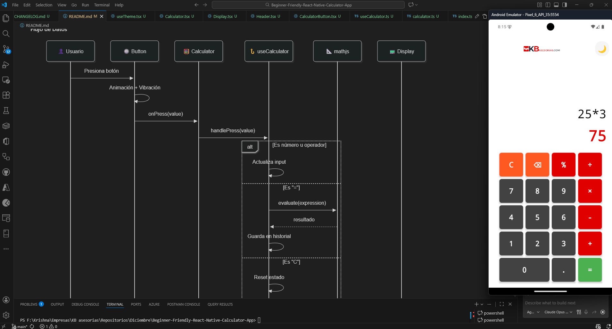
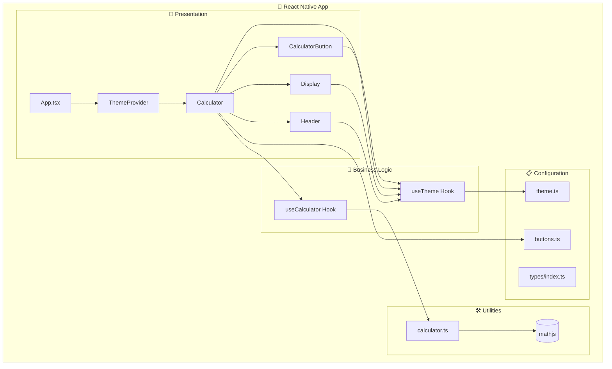
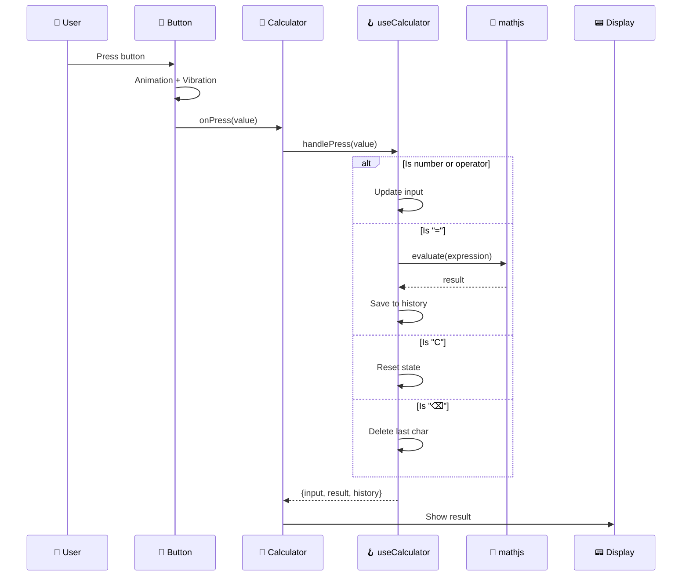
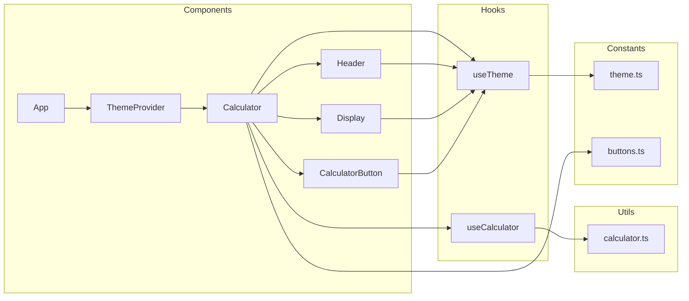
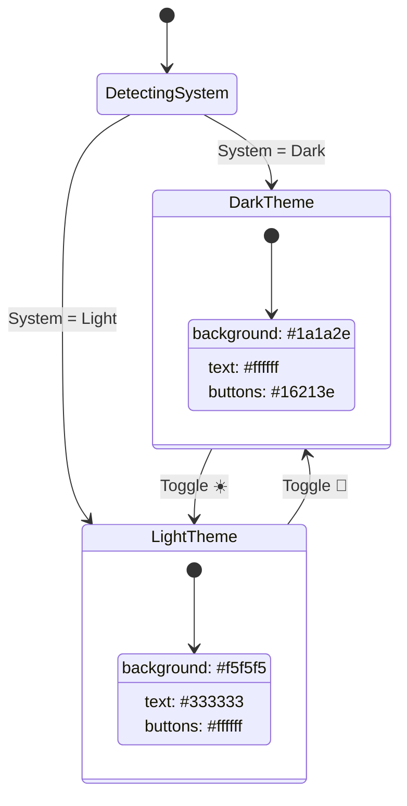
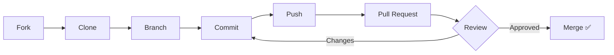

<div align="center">


# KB React Calculator

**Calculadora científica moderna con React Native**

[](https://reactnative.dev/)
[](https://www.typescriptlang.org/)
[](./LICENSE)
[](./__tests__/)

[🇪🇸 Español](./README_ES.md) | [📖 Docs](./docs/) | [🤝 Contribute](./CONTRIBUTING.md)

---



</div>

---

## 📋 Project Info

| Field | Value |
|-------|-------|
| **Project Name** | KB React Calculator |
| **Technical Name** | `KBReactCalculator` |
| **Android Package** | `com.kbasesorias.reactcalculator` |
| **iOS Bundle** | `com.kbasesorias.reactcalculator` |
| **Version** | 1.0.0 |
| **Author** | Danilo Viteri - KB Asesorías |

---

## 📑 Table of Contents

- [✨ Features](#-features)
- [🏗️ Architecture](#️-architecture)
- [📦 Installation](#-installation)
- [🚀 Quick Start](#-quick-start)
- [📂 Project Structure](#-project-structure)
- [🔧 Tech Stack](#-tech-stack)
- [🎨 Themes](#-themes)
- [🧪 Testing](#-testing)
- [📖 Documentation](#-documentation)
- [❓ FAQ](#-faq)
- [🤝 Contributing](#-contributing)
- [📜 License](#-license)
- [📞 Contact](#-contact)

---

## ✨ Features

| Category | Features |
|----------|----------|
| 🧮 **Basic Operations** | Addition, subtraction, multiplication, division |
| 🔬 **Scientific Functions** | sin, cos, tan, log, ln, √, x², x³, xʸ |
| 📐 **Mathematical Constants** | π (Pi), e (Euler) |
| ➗ **Advanced Operators** | Modulo (%), factorial (!), absolute value |
| 🌓 **Dark/Light Mode** | Dynamic toggle with system detection |
| 📳 **Haptic Feedback** | Vibration on button press |
| ✨ **Animations** | Smooth effects with Animated API |
| 📱 **Responsive Design** | Portrait (basic) and Landscape (scientific) layouts |
| 🛡️ **Secure Evaluation** | Uses mathjs instead of eval() |

---

## 🏗️ Architecture



### Data Flow



### Component Diagram



### Theme States



---

## 📦 Installation

### Prerequisites

| Tool | Minimum Version | Link |
|------|-----------------|------|
| Node.js | 18.x | [Download](https://nodejs.org/) |
| npm / yarn | 9.x / 1.22.x | Included with Node.js |
| React Native CLI | 0.78.x | `npm install -g react-native` |
| Android Studio | Latest | [Download](https://developer.android.com/studio) |
| Xcode (macOS) | 15.x | App Store |

### Step by Step

```bash
# 1. Clone the repository
git clone https://github.com/KRSNA-BLR/Beginner-Friendly-React-Native-Calculator-App.git

# 2. Enter directory
cd Beginner-Friendly-React-Native-Calculator-App

# 3. Install dependencies
npm install

# 4. For iOS (macOS only)
cd ios && pod install && cd ..
```

---

## 🚀 Quick Start

```bash
# Start Metro Bundler
npm start

# In another terminal - Android
npm run android

# In another terminal - iOS (macOS only)
npm run ios
```

### Available Scripts

| Command | Description |
|---------|-------------|
| `npm start` | Start Metro Bundler |
| `npm run android` | Run on Android |
| `npm run ios` | Run on iOS |
| `npm run lint` | Run ESLint |
| `npm run lint:fix` | Fix lint errors |
| `npm test` | Run tests |
| `npm run test:coverage` | Tests with coverage |
| `npm run clean` | Clear cache |

---

## 📂 Project Structure

```
KBReactCalculator/
├── 📁 src/                      # Main source code
│   ├── 📄 App.tsx               # Root component with ThemeProvider
│   ├── 📁 components/           # UI components
│   │   ├── 📁 Button/           # Reusable button with animations
│   │   ├── 📁 Calculator/       # Main calculator component
│   │   ├── 📁 Display/          # Display screen
│   │   └── 📁 Header/           # Header with logo
│   ├── 📁 hooks/                # Custom hooks
│   │   ├── 📄 useCalculator.ts  # Calculator logic
│   │   └── 📄 useTheme.tsx      # Theme management
│   ├── 📁 utils/                # Utility functions
│   │   └── 📄 calculator.ts     # Math evaluation with mathjs
│   ├── 📁 constants/            # Constants and config
│   │   ├── 📄 theme.ts          # Light/dark theme colors
│   │   └── 📄 buttons.ts        # Button configuration
│   └── 📁 types/                # TypeScript definitions
│       └── 📄 index.ts          # Interfaces and types
├── 📁 docs/                     # Additional documentation
│   ├── 📄 TECHNICAL_MANUAL.md
│   ├── 📄 INSTALLATION_GUIDE.md
│   └── 📄 DEVELOPER_SETUP.md
├── 📁 __tests__/                # Tests (72 passing)
├── 📁 android/                  # Android config (com.kbasesorias.reactcalculator)
├── 📁 ios/                      # iOS config (KBReactCalculator)
├── 📁 assets/                   # Images and resources
├── 📄 package.json              # Dependencies and scripts
├── 📄 tsconfig.json             # TypeScript configuration
└── 📄 README.md                 # This file
```

---

## 🔧 Tech Stack

| Category | Technology | Version |
|----------|------------|---------|
| Framework | React Native | 0.78.0 |
| UI Library | React | 19.0.0 |
| Language | TypeScript | 5.7.2 |
| Math Engine | mathjs | 15.1.0 |
| Linting | ESLint | 8.57.0 |
| Formatting | Prettier | 3.4.2 |
| Testing | Jest | 29.7.0 |

---

## 🎨 Themes

The app supports light and dark mode with automatic system detection:

| Element | 🌞 Light Theme | 🌙 Dark Theme |
|---------|----------------|---------------|
| Background | `#f5f5f5` | `#1a1a2e` |
| Text | `#333333` | `#ffffff` |
| Number buttons | `#ffffff` | `#16213e` |
| Operator buttons | `#ff9500` | `#e94560` |
| Equals button | `#4cd964` | `#0f3460` |
| Display | `#ffffff` | `#16213e` |

---

## 🧪 Testing

```bash
# Run all tests
npm test

# Tests with coverage
npm run test:coverage

# Tests in watch mode
npm test -- --watch
```

**Results:** 72 tests passing across 4 test suites.

---

## 📖 Documentation

| Document | Description |
|----------|-------------|
| [📘 Technical Manual](./docs/TECHNICAL_MANUAL.md) | Detailed architecture explanation |
| [📗 Installation Guide](./docs/INSTALLATION_GUIDE.md) | Steps to set up the project |
| [📙 Developer Setup](./docs/DEVELOPER_SETUP.md) | Development environment config |
| [📕 Contributing](./CONTRIBUTING.md) | Contributor guide |
| [📓 Code of Conduct](./CODE_OF_CONDUCT.md) | Community guidelines |
| [📋 Changelog](./CHANGELOG.md) | Version history |

---

## ❓ FAQ

<details>
<summary><b>Why use mathjs instead of eval()?</b></summary>

`eval()` is dangerous because it executes any JavaScript code, which can be exploited for code injection. `mathjs` is a specialized library that only evaluates mathematical expressions safely.
</details>

<details>
<summary><b>Does the app work offline?</b></summary>

Yes! Once installed, the calculator works completely offline.
</details>

<details>
<summary><b>How do I change the theme?</b></summary>

Tap the ☀️/🌙 icon in the top right corner to toggle between light and dark mode.
</details>

---

## 🤝 Contributing

Contributions are welcome! Please read our [Contributing Guide](./CONTRIBUTING.md) and [Code of Conduct](./CODE_OF_CONDUCT.md) before submitting a PR.



---

## 📜 License

This project is licensed under the **MIT License**. See the [LICENSE](./LICENSE) file for details.

---

## 📞 Contact

<div align="center">

| | |
|---|---|
| **Author** | Danilo Viteri |
| **Company** | KB Asesorías |
| **LinkedIn** | [danilo-viteri-moreno](https://www.linkedin.com/in/danilo-viteri-moreno/) |
| **GitHub** | [@KRSNA-BLR](https://github.com/KRSNA-BLR) |

</div>

---

<div align="center">

**KB React Calculator** © 2025 [KB Asesorías](https://www.linkedin.com/in/danilo-viteri-moreno/)

[](https://github.com/KRSNA-BLR)
[](https://www.linkedin.com/in/danilo-viteri-moreno/)

[⬆ Back to top](#kb-react-calculator) | [🐛 Report Bug](https://github.com/KRSNA-BLR/Beginner-Friendly-React-Native-Calculator-App/issues)

</div>
