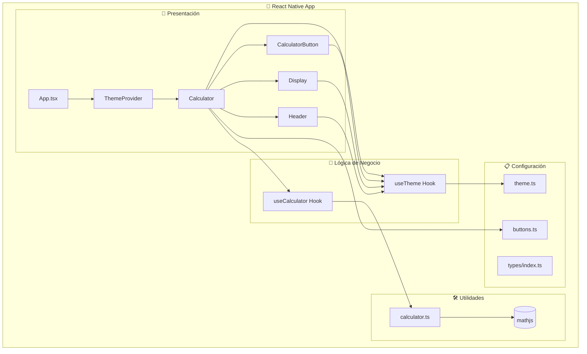
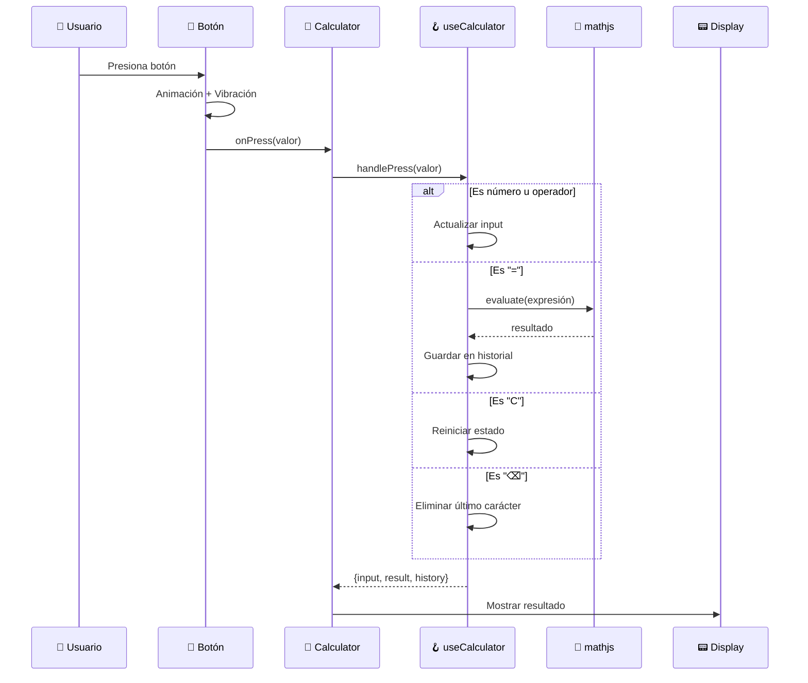
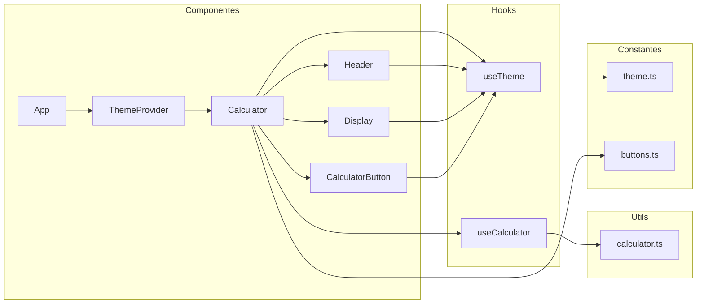
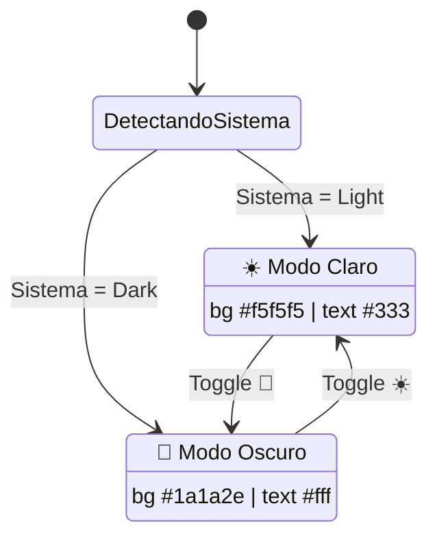
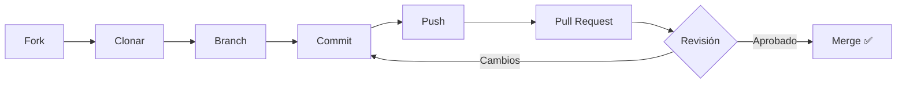

<div align="center">


# KB React Calculator

**Calculadora científica moderna con React Native**

[](https://reactnative.dev/)
[](https://www.typescriptlang.org/)
[](./LICENSE)
[](./__tests__/)

[🇺🇸 English](./README.md) | [📖 Docs](./docs/) | [🤝 Contribuir](./CONTRIBUTING.md)

---


</div>

---

## 📋 Información del Proyecto

| Campo                   | Valor                             |
| ----------------------- | --------------------------------- |
| **Nombre del Proyecto** | KB React Calculator               |
| **Nombre Técnico**      | `KBReactCalculator`               |
| **Package Android**     | `com.kbasesorias.reactcalculator` |
| **Bundle iOS**          | `com.kbasesorias.reactcalculator` |
| **Versión**             | 1.0.0                             |
| **Autor**               | Danilo Viteri - KB Asesorías      |

---

## 📑 Tabla de Contenidos

- [✨ Características](#-características)
- [🏗️ Arquitectura](#️-arquitectura)
- [📦 Instalación](#-instalación)
- [🚀 Inicio Rápido](#-inicio-rápido)
- [📂 Estructura del Proyecto](#-estructura-del-proyecto)
- [🔧 Stack Tecnológico](#-stack-tecnológico)
- [🎨 Temas](#-temas)
- [🧪 Testing](#-testing)
- [📖 Documentación](#-documentación)
- [❓ Preguntas Frecuentes](#-preguntas-frecuentes)
- [🤝 Contribuir](#-contribuir)
- [📜 Licencia](#-licencia)
- [📞 Contacto](#-contacto)

---

## ✨ Características

| Categoría                     | Funcionalidades                             |
| ----------------------------- | ------------------------------------------- |
| 🧮 **Operaciones Básicas**    | Suma, resta, multiplicación, división       |
| 🔬 **Funciones Científicas**  | sin, cos, tan, log, ln, √, x², x³, xʸ       |
| 📐 **Constantes Matemáticas** | π (Pi), e (Euler)                           |
| ➗ **Operadores Avanzados**   | Módulo (%), factorial (!), valor absoluto   |
| 🌓 **Modo Oscuro/Claro**      | Toggle dinámico con detección del sistema   |
| 📳 **Feedback Háptico**       | Vibración al presionar botones              |
| ✨ **Animaciones**            | Efectos suaves con Animated API             |
| 📱 **Diseño Responsivo**      | Vertical (básico) y Horizontal (científico) |
| 🛡️ **Evaluación Segura**      | Usa mathjs en lugar de eval()               |

---

## 🏗️ Arquitectura



### Flujo de Datos



### Diagrama de Componentes



### Estados del Tema



---

## 📦 Instalación

### Prerrequisitos

| Herramienta      | Versión Mínima | Enlace                                            |
| ---------------- | -------------- | ------------------------------------------------- |
| Node.js          | 18.x           | [Descargar](https://nodejs.org/)                  |
| npm / yarn       | 9.x / 1.22.x   | Incluido con Node.js                              |
| React Native CLI | 0.78.x         | `npm install -g react-native`                     |
| Android Studio   | Última         | [Descargar](https://developer.android.com/studio) |
| Xcode (macOS)    | 15.x           | App Store                                         |

### Paso a Paso

```bash
# 1. Clonar el repositorio
git clone https://github.com/KRSNA-BLR/Beginner-Friendly-React-Native-Calculator-App.git

# 2. Entrar al directorio
cd Beginner-Friendly-React-Native-Calculator-App

# 3. Instalar dependencias
npm install

# 4. Para iOS (solo macOS)
cd ios && pod install && cd ..
```

---

## 🚀 Inicio Rápido

```bash
# Iniciar Metro Bundler
npm start

# En otra terminal - Android
npm run android

# En otra terminal - iOS (solo macOS)
npm run ios
```

### Scripts Disponibles

| Comando                 | Descripción              |
| ----------------------- | ------------------------ |
| `npm start`             | Iniciar Metro Bundler    |
| `npm run android`       | Ejecutar en Android      |
| `npm run ios`           | Ejecutar en iOS          |
| `npm run lint`          | Ejecutar ESLint          |
| `npm run lint:fix`      | Corregir errores de lint |
| `npm test`              | Ejecutar tests           |
| `npm run test:coverage` | Tests con cobertura      |
| `npm run clean`         | Limpiar caché            |

---

## 📂 Estructura del Proyecto

```
KBReactCalculator/
├── 📁 src/                      # Código fuente principal
│   ├── 📄 App.tsx               # Componente raíz con ThemeProvider
│   ├── 📁 components/           # Componentes de UI
│   │   ├── 📁 Button/           # Botón reutilizable con animaciones
│   │   ├── 📁 Calculator/       # Componente principal de calculadora
│   │   ├── 📁 Display/          # Pantalla de resultados
│   │   └── 📁 Header/           # Encabezado con logo
│   ├── 📁 hooks/                # Custom hooks
│   │   ├── 📄 useCalculator.ts  # Lógica de calculadora
│   │   └── 📄 useTheme.tsx      # Gestión de temas
│   ├── 📁 utils/                # Funciones utilitarias
│   │   └── 📄 calculator.ts     # Evaluación matemática con mathjs
│   ├── 📁 constants/            # Constantes y configuración
│   │   ├── 📄 theme.ts          # Colores de temas claro/oscuro
│   │   └── 📄 buttons.ts        # Configuración de botones
│   └── 📁 types/                # Definiciones TypeScript
│       └── 📄 index.ts          # Interfaces y tipos
├── 📁 docs/                     # Documentación adicional
│   ├── 📄 TECHNICAL_MANUAL_ES.md
│   ├── 📄 INSTALLATION_GUIDE_ES.md
│   └── 📄 DEVELOPER_SETUP_ES.md
├── 📁 __tests__/                # Tests (72 pasando)
├── 📁 android/                  # Config Android (com.kbasesorias.reactcalculator)
├── 📁 ios/                      # Config iOS (KBReactCalculator)
├── 📁 assets/                   # Imágenes y recursos
├── 📄 package.json              # Dependencias y scripts
├── 📄 tsconfig.json             # Configuración TypeScript
└── 📄 README_ES.md              # Este archivo
```

---

## 🔧 Stack Tecnológico

| Categoría        | Tecnología   | Versión |
| ---------------- | ------------ | ------- |
| Framework        | React Native | 0.78.0  |
| Librería UI      | React        | 19.0.0  |
| Lenguaje         | TypeScript   | 5.7.2   |
| Motor Matemático | mathjs       | 15.1.0  |
| Linting          | ESLint       | 8.57.0  |
| Formateo         | Prettier     | 3.4.2   |
| Testing          | Jest         | 29.7.0  |

---

## 🎨 Temas

La app soporta modo claro y oscuro con detección automática del sistema:

| Elemento          | 🌞 Tema Claro | 🌙 Tema Oscuro |
| ----------------- | ------------- | -------------- |
| Fondo             | `#f5f5f5`     | `#1a1a2e`      |
| Texto             | `#333333`     | `#ffffff`      |
| Botones numéricos | `#ffffff`     | `#16213e`      |
| Botones operador  | `#ff9500`     | `#e94560`      |
| Botón igual       | `#4cd964`     | `#0f3460`      |
| Display           | `#ffffff`     | `#16213e`      |

---

## 🧪 Testing

```bash
# Ejecutar todos los tests
npm test

# Tests con cobertura
npm run test:coverage

# Tests en modo watch
npm test -- --watch
```

**Resultado:** 72 tests pasando en 4 suites de tests.

---

## 📖 Documentación

| Documento                                                 | Descripción                              |
| --------------------------------------------------------- | ---------------------------------------- |
| [📘 Manual Técnico](./docs/TECHNICAL_MANUAL_ES.md)        | Explicación detallada de la arquitectura |
| [📗 Guía de Instalación](./docs/INSTALLATION_GUIDE_ES.md) | Pasos para configurar el proyecto        |
| [📙 Setup de Desarrollo](./docs/DEVELOPER_SETUP_ES.md)    | Configuración del entorno de desarrollo  |
| [📕 Contribuir](./CONTRIBUTING.md)                        | Guía de contribución                     |
| [📓 Código de Conducta](./CODE_OF_CONDUCT.md)             | Directrices de la comunidad              |
| [📋 Changelog](./CHANGELOG.md)                            | Historial de versiones                   |

---

## ❓ Preguntas Frecuentes

<details>
<summary><b>¿Por qué usar mathjs en lugar de eval()?</b></summary>

`eval()` es peligroso porque ejecuta cualquier código JavaScript, lo que puede ser explotado para inyección de código. `mathjs` es una librería especializada que solo evalúa expresiones matemáticas de forma segura.

</details>

<details>
<summary><b>¿La app funciona sin conexión?</b></summary>

¡Sí! Una vez instalada, la calculadora funciona completamente offline.

</details>

<details>
<summary><b>¿Cómo cambio el tema?</b></summary>

Toca el ícono ☀️/🌙 en la esquina superior derecha para alternar entre modo claro y oscuro.

</details>

---

## 🤝 Contribuir

¡Las contribuciones son bienvenidas! Por favor lee nuestra [Guía de Contribución](./CONTRIBUTING.md) y el [Código de Conducta](./CODE_OF_CONDUCT.md) antes de enviar un PR.



---

## 📜 Licencia

Este proyecto está bajo la licencia **MIT License**. Ver el archivo [LICENSE](./LICENSE) para más detalles.

---

## 📞 Contacto

<div align="center">

|              |                                                                           |
| ------------ | ------------------------------------------------------------------------- |
| **Autor**    | Danilo Viteri                                                             |
| **Empresa**  | KB Asesorías                                                              |
| **LinkedIn** | [danilo-viteri-moreno](https://www.linkedin.com/in/danilo-viteri-moreno/) |
| **GitHub**   | [@KRSNA-BLR](https://github.com/KRSNA-BLR)                                |

</div>

---

<div align="center">

**KB React Calculator** © 2025 [KB Asesorías](https://www.linkedin.com/in/danilo-viteri-moreno/)

[](https://github.com/KRSNA-BLR)
[](https://www.linkedin.com/in/danilo-viteri-moreno/)

[⬆ Volver arriba](#kb-react-calculator) | [🐛 Reportar Bug](https://github.com/KRSNA-BLR/Beginner-Friendly-React-Native-Calculator-App/issues)

</div>
