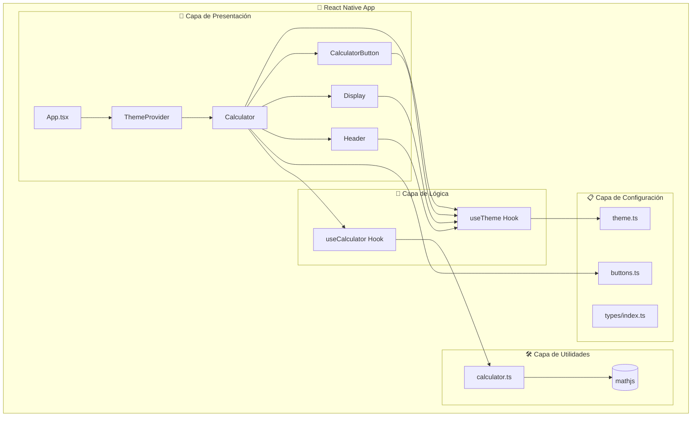
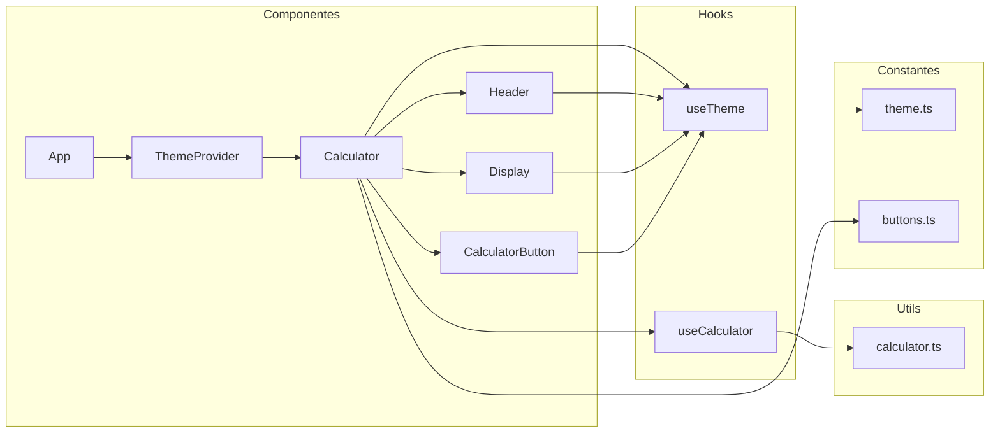
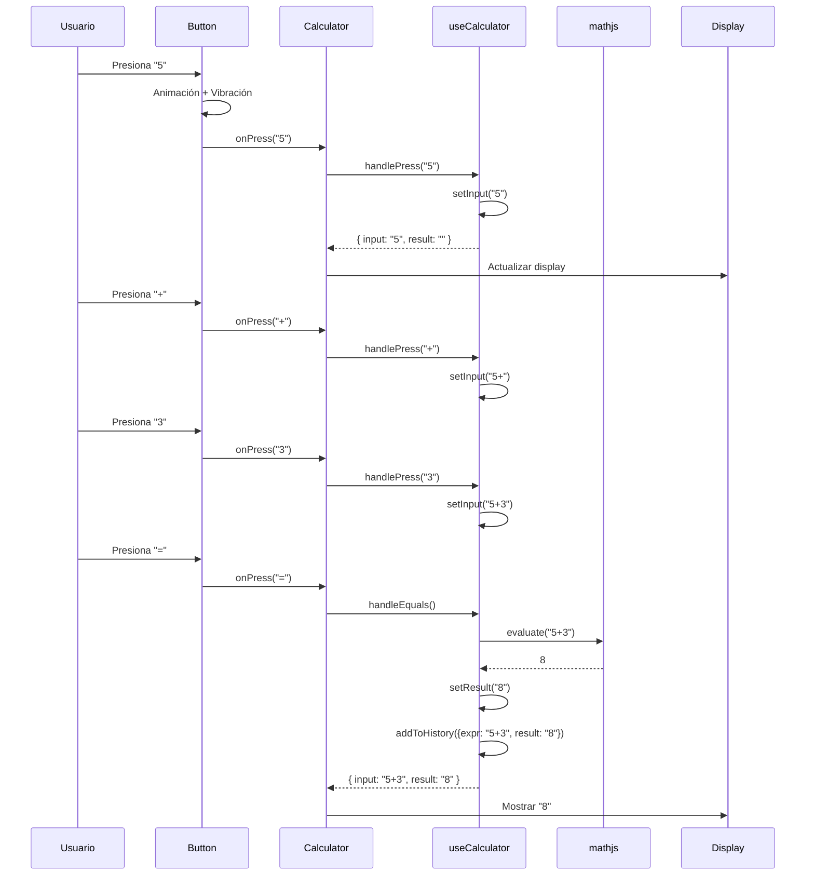
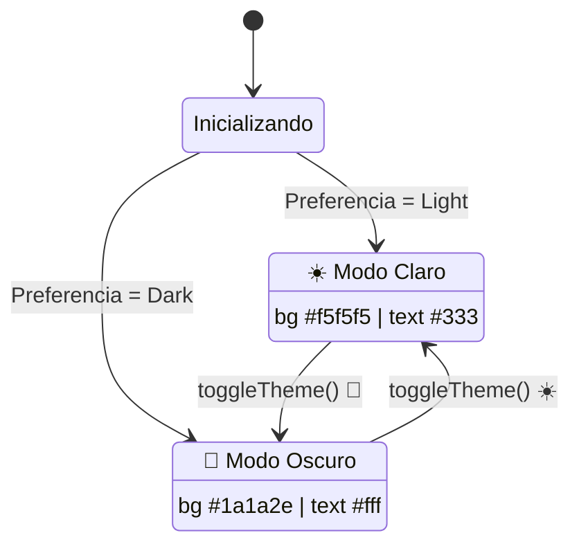

<div align="center">


# 📘 Manual Técnico

**KB React Calculator** - Documentación Técnica

[🇺🇸 English](./TECHNICAL_MANUAL.md) | [🇪🇸 Español](./TECHNICAL_MANUAL_ES.md) | [⬅ Volver](../README_ES.md)

</div>

---

## 📑 Tabla de Contenidos

- [🏗️ Arquitectura General](#️-arquitectura-general)
- [📂 Estructura del Proyecto](#-estructura-del-proyecto)
- [🧩 Componentes](#-componentes)
- [🪝 Custom Hooks](#-custom-hooks)
- [🛠️ Utilidades](#️-utilidades)
- [📋 Constantes](#-constantes)
- [🔧 Tecnologías](#-tecnologías)
- [📊 Flujo de Datos](#-flujo-de-datos)
- [🎨 Sistema de Temas](#-sistema-de-temas)

---

## 🏗️ Arquitectura General



### Principios de Diseño

| Principio                           | Implementación                                           |
| ----------------------------------- | -------------------------------------------------------- |
| **Separación de Responsabilidades** | UI en componentes, lógica en hooks, utilidades separadas |
| **Componentes Reutilizables**       | `CalculatorButton` sirve para todos los tipos de botones |
| **Estado Centralizado**             | `useCalculator` maneja todo el estado de la calculadora  |
| **Temas Dinámicos**                 | Context API para tema global claro/oscuro                |
| **Seguridad**                       | mathjs en lugar de eval() para evaluar expresiones       |

---

## 📂 Estructura del Proyecto

```
KBReactCalculator/
├── 📁 src/                          # Código fuente principal
│   ├── 📄 App.tsx                   # Componente raíz
│   │
│   ├── 📁 components/               # Componentes de UI
│   │   ├── 📁 Button/
│   │   │   └── CalculatorButton.tsx # Botón con animaciones
│   │   ├── 📁 Calculator/
│   │   │   └── Calculator.tsx       # Componente principal
│   │   ├── 📁 Display/
│   │   │   └── Display.tsx          # Pantalla de resultados
│   │   └── 📁 Header/
│   │       └── Header.tsx           # Encabezado con logo
│   │
│   ├── 📁 hooks/                    # Custom hooks
│   │   ├── useCalculator.ts         # Lógica de calculadora
│   │   └── useTheme.tsx             # Contexto de tema
│   │
│   ├── 📁 utils/                    # Funciones utilitarias
│   │   └── calculator.ts            # Evaluación matemática
│   │
│   ├── 📁 constants/                # Constantes
│   │   ├── theme.ts                 # Colores de temas
│   │   └── buttons.ts               # Configuración de botones
│   │
│   └── 📁 types/                    # Tipos TypeScript
│       └── index.ts                 # Interfaces
│
├── 📁 __tests__/                    # Tests (72 tests, 4 suites)
│   ├── App.test.tsx
│   ├── calculator.test.ts
│   ├── useCalculator.test.tsx
│   └── snapshots.test.tsx
│
├── 📁 docs/                         # Documentación
├── 📁 .github/                      # GitHub Actions, templates
├── 📁 android/                      # Android (com.kbasesorias.reactcalculator)
├── 📁 ios/                          # iOS (KBReactCalculator)
└── 📁 assets/                       # Imágenes y recursos
```

---

## 🧩 Componentes

### Diagrama de Componentes



### App.tsx

**Ubicación:** `src/App.tsx`

Componente raíz que envuelve la aplicación con el `ThemeProvider`.

```typescript
const App: React.FC = () => {
  return (
    <ThemeProvider>
      <AppContent />
    </ThemeProvider>
  );
};
```

### Calculator

**Ubicación:** `src/components/Calculator/Calculator.tsx`

Componente principal que orquesta todos los demás componentes.

**Responsabilidades:**

- Renderizar el layout de la calculadora
- Manejar interacciones del usuario
- Coordinar Display, Header y Buttons
- Toggle de tema claro/oscuro

**Props:** Ninguna (usa hooks para estado)

### CalculatorButton

**Ubicación:** `src/components/Button/CalculatorButton.tsx`

Botón reutilizable con animaciones y feedback háptico.

**Props:**

| Prop      | Tipo                                                | Descripción                  |
| --------- | --------------------------------------------------- | ---------------------------- |
| `label`   | `string`                                            | Texto del botón              |
| `onPress` | `() => void`                                        | Callback al presionar        |
| `type`    | `'number' \| 'operator' \| 'function' \| 'special'` | Tipo para estilos            |
| `wide`    | `boolean?`                                          | Si el botón es ancho (doble) |

**Características:**

- Animación de escala con `Animated.spring()`
- Vibración háptica en Android
- Colores dinámicos según tema

### Display

**Ubicación:** `src/components/Display/Display.tsx`

Muestra la expresión actual y el resultado.

**Props:**

| Prop     | Tipo     | Descripción         |
| -------- | -------- | ------------------- |
| `input`  | `string` | Expresión actual    |
| `result` | `string` | Resultado calculado |

### Header

**Ubicación:** `src/components/Header/Header.tsx`

Logo y título de la aplicación.

---

## 🪝 Custom Hooks

### useCalculator

**Ubicación:** `src/hooks/useCalculator.ts`

Maneja toda la lógica de la calculadora.

**Retorna:**

| Propiedad         | Tipo                      | Descripción              |
| ----------------- | ------------------------- | ------------------------ |
| `input`           | `string`                  | Expresión actual         |
| `result`          | `string`                  | Último resultado         |
| `history`         | `HistoryEntry[]`          | Historial de operaciones |
| `handlePress`     | `(value: string) => void` | Agregar valor            |
| `handleClear`     | `() => void`              | Limpiar todo             |
| `handleBackspace` | `() => void`              | Borrar último carácter   |
| `handleEquals`    | `() => void`              | Calcular resultado       |

**Ejemplo de uso:**

```typescript
const {input, result, handlePress, handleEquals} = useCalculator();
```

### useTheme

**Ubicación:** `src/hooks/useTheme.tsx`

Contexto para el sistema de temas.

**Retorna:**

| Propiedad     | Tipo          | Descripción                   |
| ------------- | ------------- | ----------------------------- |
| `isDark`      | `boolean`     | Si el tema oscuro está activo |
| `colors`      | `ThemeColors` | Colores del tema actual       |
| `toggleTheme` | `() => void`  | Alternar tema                 |

---

## 🛠️ Utilidades

### calculator.ts

**Ubicación:** `src/utils/calculator.ts`

Funciones para evaluación matemática segura.

| Función                                        | Descripción                          |
| ---------------------------------------------- | ------------------------------------ |
| `evaluateExpression(expr: string)`             | Evalúa expresión con mathjs          |
| `sanitizeExpression(input: string)`            | Convierte símbolos a sintaxis mathjs |
| `isValidExpression(expr: string)`              | Valida caracteres permitidos         |
| `formatNumber(num: number)`                    | Formatea con separadores de miles    |
| `preprocessExpression(expr: string)`           | Preprocesa antes de evaluar          |
| `canAddCharacter(input: string, char: string)` | Valida si se puede agregar carácter  |
| `removeLastCharacter(input: string)`           | Elimina último carácter/función      |

**Seguridad:**

```typescript
// ❌ PELIGROSO - eval puede ejecutar código arbitrario
const result = eval(userInput);

// ✅ SEGURO - mathjs solo evalúa matemáticas
import {evaluate} from 'mathjs';
const result = evaluate(sanitizedInput);
```

---

## 📋 Constantes

### theme.ts

**Ubicación:** `src/constants/theme.ts`

Define los colores para temas claro y oscuro.

```typescript
export const lightTheme: ThemeColors = {
  background: '#f5f5f5',
  display: '#ffffff',
  text: '#333333',
  // ...
};

export const darkTheme: ThemeColors = {
  background: '#1a1a2e',
  display: '#16213e',
  text: '#ffffff',
  // ...
};
```

### buttons.ts

**Ubicación:** `src/constants/buttons.ts`

Configuración del layout de botones.

```typescript
export const BUTTON_ROWS: ButtonConfig[][] = [
  [{ label: 'C', type: 'special' }, { label: '⌫', type: 'special' }, ...],
  // ...
];
```

---

## 🔧 Tecnologías

| Categoría   | Tecnología                    | Versión | Uso                  |
| ----------- | ----------------------------- | ------- | -------------------- |
| Framework   | React Native                  | 0.78.0  | Base de la app       |
| UI Library  | React                         | 19.0.0  | Componentes          |
| Lenguaje    | TypeScript                    | 5.7.2   | Tipado estático      |
| Matemáticas | mathjs                        | 15.1.0  | Evaluación segura    |
| Testing     | Jest                          | 29.7.0  | Unit tests           |
| Testing     | @testing-library/react-native | -       | Tests de componentes |
| Linting     | ESLint                        | 8.57.0  | Calidad de código    |
| Formatting  | Prettier                      | 3.4.2   | Formato consistente  |

---

## 📊 Flujo de Datos



---

## 🎨 Sistema de Temas

### Estados del Tema



### Colores por Tema

| Elemento       | 🌞 Claro  | 🌙 Oscuro |
| -------------- | --------- | --------- |
| Fondo          | `#f5f5f5` | `#1a1a2e` |
| Display        | `#ffffff` | `#16213e` |
| Texto          | `#333333` | `#ffffff` |
| Botón número   | `#ffffff` | `#16213e` |
| Botón operador | `#ff9500` | `#e94560` |
| Botón igual    | `#4cd964` | `#0f3460` |
| Botón especial | `#a5a5a5` | `#533483` |

---

## 🔄 Actualización de Dependencias

- Revisar dependencias desactualizadas:
  ```bash
  npm outdated
  ```
- Actualizar todas las dependencias:
  ```bash
  npm update
  ```
- Actualizar React Native a la última versión:
  ```bash
  npx react-native upgrade
  ```

---

## 📄 Guía de Pruebas

1. **Pruebas Unitarias**:
   - Ubicadas en el directorio `__tests__/`.
   - Ejecuta las pruebas utilizando:
     ```bash
     npm test
     ```
2. **Añadiendo Nuevas Pruebas**:
   - Escribe casos de prueba para nuevas características o correcciones de errores.
   - Sigue la estructura de pruebas existente para mantener la consistencia.

---

<div align="center">

**KB React Calculator** © 2025 [KB Asesorías](https://www.linkedin.com/in/danilo-viteri-moreno/)

[⬆ Volver arriba](#-manual-técnico) | [📖 Docs](../docs/) | [🐛 Issues](https://github.com/KRSNA-BLR/Beginner-Friendly-React-Native-Calculator-App/issues)

</div>
